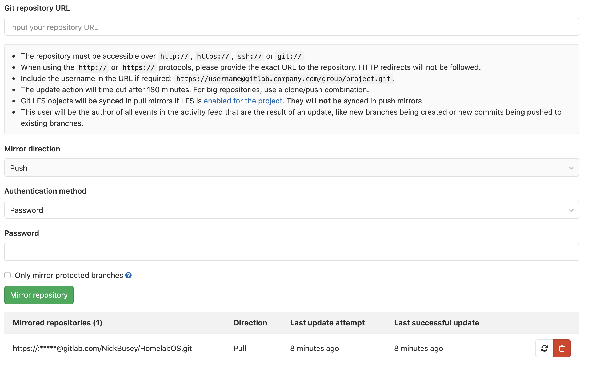
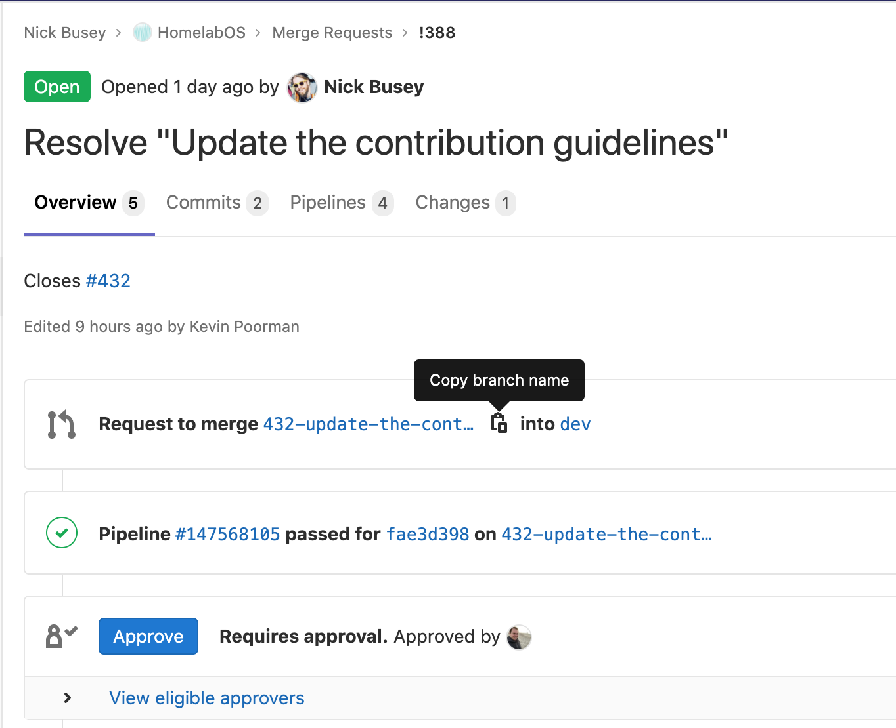

# Contribution Guidelines

## Overview of project's development workflow

VivumLab follows a common Open Source Software development workflow. A core group of maintainers handle the branching, merging and tagging of releases. While this core group shepherds the overall project, everyone is welcome to contribute. This document goes into detail on how you can contribute.

# Submitting Merge Requests

All work should start with an [issue on Github](https://github.com/VivumLaboratory/VivumLab/issues/new). After creating a detailed issue, it's usually best to wait a day or two before beginning work, to gather feedback from the community.

A good MR is small and changes as few lines of code as possible to resolve the issue. Multiple smaller separate MRs are ofter better than one big MR that touches multiple areas of the code. They're easier to review, test, and merge.

A large MR with several unrelated fixes in it can be held up from being merged because of one particular thing that only affected one piece of the MR. Had they been separate MRs, only the MR that has a problem or needs a change will be held up.

### Contribution overview

To contribute a bug fix, service, or enhancement you'll need to:

1. Establish and maintain a mirrored Fork
2. Branch Dev in your fork
3. Develop your feature/fix
4. Commit to your branch on your fork
5. Create a Merge Request

## Getting set up to contribute

To set yourself up to contribute to VivumLab, you'll need a working understanding of Git, and a Gitlab account. Those prequisites are left as an exercise to the reader.

1. Create your own fork by clicking the "Fork" button at https://github.com/VivumLaboratory/VivumLab: 

2. In your fork, goto Settings/Repository -> "Mirroring repositories" and setup mirroring of VivumLaboratory/VivumLab

    Mirror direction = Pull
    Only mirror protected branches = enabled

3. Then set your Protected Branches in Settings/Repository -> "Protected Branches" like this

(you can ignore CODEOWNER though) you can even set push to "no one" so you can't accidentally push to that branch.

## Making a contribution to an existing Issue

Gitlab is great for tracking changes to source code, but it relies on the developer who made the changes to *push* those changes to gitlab. Because of this, the first rule of contributing to an existing issue, is to **Communicate** with the original issue creator. It helps everyone involved if you handle that communication through comments on the issue itself. Once you and the original author(s) are on the same page, the following git steps will help you check out the branch and submit changes.

1. Make sure you don't have any outstanding un-related changes in your local repository with `git status`. You should see `nothing to commit, working tree clean`.
2. Identify the branch name by navigating to the issues' linked Merge Request and clicking the copy icon next to the Branch name.
    
4. Run `git fetch origin`
5. Run `git checkout <<branch name>>`
6. Make your changes
7. Commit and Push

## Making a contribution to a new Issue

1. Make sure you don't have any outstanding un-related changes in your local repository with `git status`. You should see `nothing to commit, working tree clean`.
2. Create an issue in the [master project Github](https://github.com/VivumLaboratory/VivumLab/issues). From this issue, click the `Create Merge Request` button.
3. Now click the `Check Out Branch` button and copy Step 1, run that command on your local copy of the repository.
4. Now make your changes and commit and push them.
5. In Github, go to your Merge Request and make sure it is not labeled WIP and that all the check boxes are checked (If applicable).

Once you've submitted the MR it will be reviewed, and if it receives 2 approvals, it will be merged. You don't need to do anything after submitting unless requested. Don't worry about rebasing, or closing the merge request. If the Merge Request needs changes, the maintainers will add commends describing the needed changes, add `WIP:` back to the start of the title, and assign it back to the submitter.

> If/When you are ask to rebase run:
> `git checkout dev`
> `git pull`
> `git checkout your-new-feature`
> `git rebase dev`

## Before submitting a merge request install pre-commit (optional)

###Quote from Pre-Commit
> Git hook scripts are useful for identifying simple issues before submission to code review. We run our hooks on every commit to automatically point out issues in code such as missing semicolons, trailing whitespace, and debug statements. By pointing these issues out before code review, this allows a code reviewer to focus on the architecture of a change while not wasting time with trivial style nitpicks.

### Installation instructions

Before you can run hooks, you need to have the pre-commit package manager installed.

Using pip:
Run `pip install pre-commit`

Using [homebrew](https://brew.sh/):
`brew install pre-commit`

Install the git hook scripts
cd to the folder from where you run `make`,
run `pre-commit install` to set up the git hook scripts.

(optional) Run against all the files
`pre-commit run --all-files`

# Working with Issues

### Labels

`enhancement` is for any issue that changes how VivumLab itself deploys/operates.

`package` is for new packages people would like added to VivumLab. These should not be marked as `enhancement`s.

`bug` is for bugs. :)

## Developing Locally with Vagrant

You can play around with the stack locally without needing an actual server to spin it up against.
First run `make config` as normal. The local IP and SSH username are not used for Vagrant, so they can be
for your real server, or fake. For `What is the domain you have pointed at your Vivumlab server with ports 80 and 443?:`
enter `localhost`.

Now run `make develop` to spin up a local instance inside a Vagrant machine.
For easy access to the services run `vagrant ssh -c "cat {{ volumes_root }}/vivumlab_hosts"`. Append the output of this to your
machine's host file (usually `/etc/hosts`). Now you should be able to access http://servicename.localhost:2280/
where `servicename` is the name of any services you have enabled in `config.yml`.
If you make changes to the Ansible scripts you can run `make provision` to run them again.

To deploy just one service you can run `make update_one SERVICE_NAME` e.g. `make update_one zulip`

To run just one set of tags you can run `make tag TAG_NAME` e.g. `make tag tinc`

`[client]$ make web` - Spins up a development stack

`[client]$ make lint` - Run linting scripts

## Working locally on the documentation

To serve the docs locally run `make docs_local`.

## Working locally on the website

To work on the [VivumLab website](https://vivumlab.com/) just type `make web` to serve it locally.
